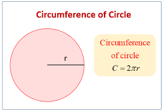

# Circle-Circumference
This is completely created using C++

# How to use
⭕ copy the password_generator here and save as password_generator.cpp

⭕ If you have an IDE, run the file using it.

⭕ If you haven't, go to https://onlinegdb.com/online_c_compiler and run the copied code.

⭕ you can run it using CMD or Terminal also.

    g++ -o runProgram password_generator.cpp
    
    that is the code
    
# Download

You can download this as a .zip file
